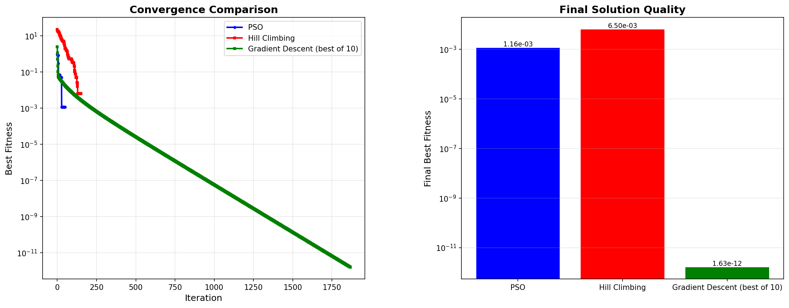
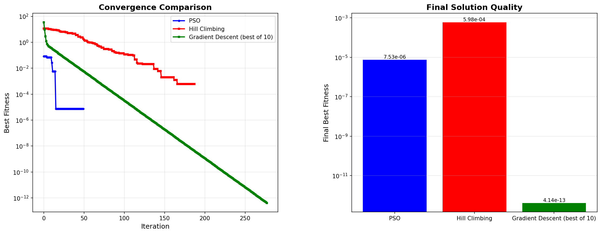
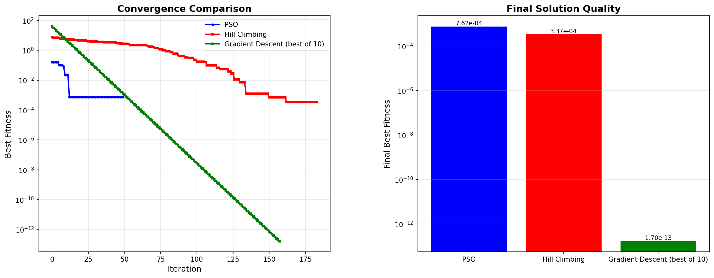
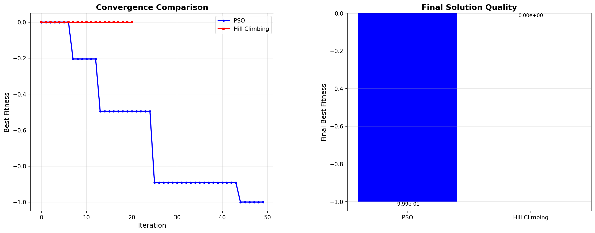
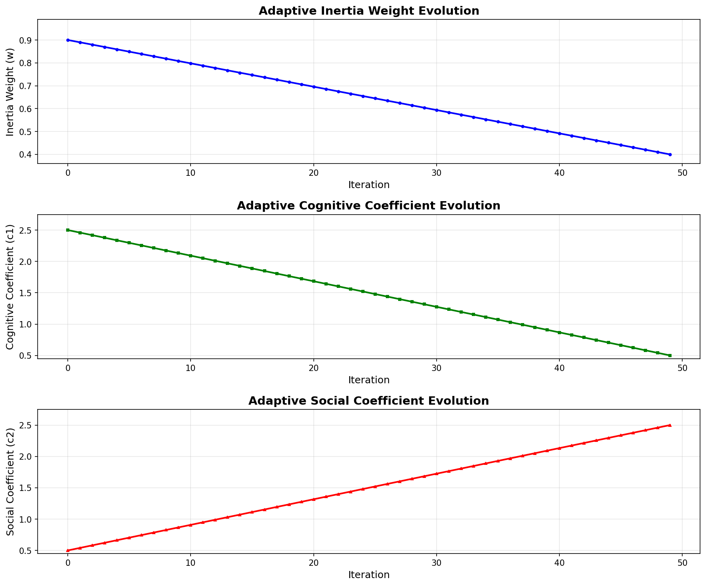
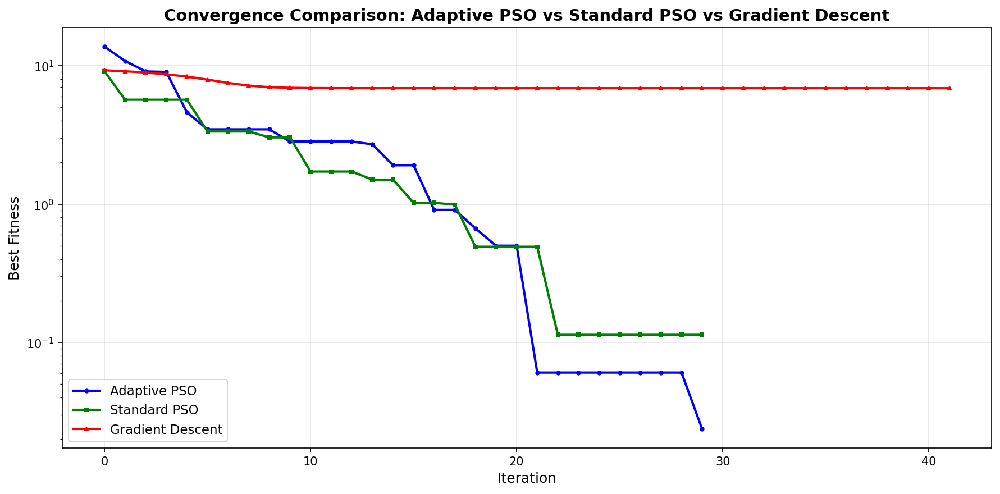

# Particle Swarm Optimization
## Metaheuristic Optimization Algorithms and Their Real-World Applications

  
    Press Space for next page <carbon:arrow-right class="inline"/>
  

---
layout: center
class: text-center
---

# What is PSO?

**Particle Swarm Optimization** is a search algorithm

Inspired by how **birds flock** or **fish school**

Each particle = one possible solution

Particles work together to find the best solution

---
layout: center
class: text-center
---

# Key Idea

**Swarm Intelligence**

Many particles search together

They share information about good solutions

This helps them find the best answer faster

---
layout: center
class: text-center
---

# Main Advantages

✅ No gradient needed  
✅ Works on any function  
✅ Finds global minimum  
✅ Escapes local minima  
✅ Simple to use  

✅ Few parameters  
✅ Fast convergence  
✅ Parallel processing  
✅ Robust results  
✅ Easy to code  

---
layout: default
---

# The PSO Formula

## Velocity Update

$$v_{t+1} = w \cdot v_t + c_1 r_1 (p_{best} - x_t) + c_2 r_2 (g_{best} - x_t)$$

## Position Update

$$x_{t+1} = x_t + v_{t+1}$$

Works for any number of dimensions (1D, 2D, 3D, ...)

---
layout: center
class: text-center
---

# Multi-Dimensional Formula

## Works for Any Dimension

**The formula is the same for:**
- 1D: $x = [x_1]$
- 2D: $x = [x_1, x_2]$
- 3D: $x = [x_1, x_2, x_3]$
- N-D: $x = [x_1, x_2, ..., x_n]$

**All operations are vector operations:**
- $v_t$, $x_t$, $p_{best}$, $g_{best}$ are all vectors
- Each dimension updated independently
- Same formula applies to all dimensions

---
layout: center
class: text-center
---

# Part 1: Inertia

## $w \cdot v_t$

**What it does:**
- Keeps particle moving in same direction
- Like momentum in physics

**Inertia Weight ($w$):**
- High $w$ (0.9) = keeps moving = explores more
- Low $w$ (0.4) = stops quickly = converges fast

---
layout: center
class: text-center
---

# Part 2: Cognitive

## $c_1 r_1 (p_{best} - x_t)$

**What it does:**
- Pulls particle toward its **own best position**
- Each particle remembers where it did best

**Cognitive Coefficient ($c_1$):**
- Higher = stronger pull to personal best
- Typical value: 1.5 to 2.0

---
layout: center
class: text-center
---

# Part 3: Social

## $c_2 r_2 (g_{best} - x_t)$

**What it does:**
- Pulls particle toward **swarm's best position**
- All particles know the best solution found

**Social Coefficient ($c_2$):**
- Higher = faster convergence
- Typical value: 1.5 to 2.0

---
layout: default
---

# How They Work Together

**New velocity =**

Keep going (Inertia)  
+  
Go to my best (Cognitive)  
+  
Go to swarm's best (Social)

**Result:** Particle moves toward better solutions

  

---
layout: default
---

# Step-by-Step Algorithm

## Step 1: Initialize

- Create N particles
- Random positions
- Random velocities
- Find initial best

## Step 2: For Each Particle

- Update velocity using formula
- Update position
- Evaluate fitness

---
layout: default
---

# Step-by-Step Algorithm (continued)

## Step 3: Update Best Positions

- If current is better than personal best:
  - Update personal best
- If current is better than global best:
  - Update global best

## Step 4: Repeat

- Go back to Step 2
- Continue until convergence
- Or maximum iterations reached

---
layout: two-cols
---

# PSO Parameters

## Inertia Weight ($w$)

- Controls exploration
- High (0.9): Explore more
- Low (0.4): Converge faster
- Typical: 0.7

## Cognitive ($c_1$)

- Personal best attraction
- Typical: 1.5 - 2.0

::right::

## Social ($c_2$)

- Global best attraction
- Typical: 1.5 - 2.0

## Swarm Size

- Number of particles
- Small (10-20): Fast
- Medium (30-50): Balanced
- Large (100+): Better search

---
layout: center
class: text-center
---

PSO in Action: Sphere Function

  

  Particles converge to global minimum at (0, 0)

---
layout: center
class: text-center
---

PSO on Rastrigin Function

  

  Many local minima - PSO navigates through them

---
layout: center
class: text-center
---

PSO on Ackley Function

  

  Multimodal function - PSO finds global minimum

---
layout: two-cols
---

# Convergence Analysis

  
  
Sphere

  
  
Rastrigin

::right::

  
  
Ackley

## Observations

- Fast on simple functions
- Steady on complex functions
- Finds global minimum
- Robust performance

---
layout: center
class: text-center
---

Non-Symmetrical: Beale Function

  

  Valley-shaped, non-symmetrical - PSO finds minimum at (3, 0.5)

---
layout: center
class: text-center
---

Non-Symmetrical: Goldstein-Price

  

  Multiple local minima - PSO explores and finds best

---
layout: center
class: text-center
---

Non-Symmetrical: Rotated Ellipsoid

  

  Rotated search space - PSO adapts to non-symmetrical landscape

---
layout: two-cols
---

# Convergence: Non-Symmetrical

  
  
Beale

  
  
Goldstein-Price

::right::

  
  
Rotated Ellipsoid

## PSO Advantages

✅ No gradient needed  
✅ Explores entire space  
✅ Handles local minima  
✅ Single run works  

---
layout: default
---

# PSO vs Traditional Methods

  
  
Beale Function

  
  
Goldstein-Price

---
layout: default
---

# More Comparisons

  
  
Three-Hump Camel

  
  
Rotated Ellipsoid

---
layout: default
---

# Additional Comparisons

  
  
Shifted Sphere

  
  
Easom Function

---
layout: default
---

# When Gradient Descent is Better

✅ Smooth functions  
✅ Gradient available  
✅ Unimodal problems  
✅ Well-tuned parameters  

**But needs:**
- Multiple trials (10+)
- Careful tuning
- Gradient computation

---
layout: default
---

# When PSO is Better

✅ **Multimodal functions** - escapes local minima  
✅ **No gradient needed** - works on any function  
✅ **Non-symmetrical** - explores entire space  
✅ **Single run** - no multiple trials  
✅ **Less tuning** - more forgiving  
✅ **Parallelizable** - can use all cores  

---
layout: default
---

# Why PSO is Fast: Reason 1

## Parallel Evaluation

**All particles evaluated at once**

- Traditional: One at a time
- PSO: All together
- **Result:** Up to N× faster
- Can use GPU acceleration

---
layout: default
---

# Why PSO is Fast: Reason 2

## No Gradient Computation

**Only function evaluation needed**

- Gradient Descent: Must compute derivatives
- PSO: Just evaluate function
- **Result:** 2-10× faster per step
- Works on black-box functions

---
layout: default
---

# Why PSO is Fast: Reason 3

## Efficient Search Strategy

**Swarm intelligence = smart search**

- Single point: Random walk
- Swarm: Coordinated search
- **Result:** Finds solutions faster
- Less wasted computation

---
layout: default
---

# Why PSO is Fast: Reason 4

## Fewer Iterations Needed

**Global search converges quickly**

- Local methods: Many iterations
- PSO: Fewer iterations
- **Result:** Faster overall
- Especially on complex functions

---
layout: center
class: text-center
---

# Next Level: Adaptive PSO

**Improvement over Standard PSO**

Parameters **adapt** during optimization

**Early stage:** Explore more  
**Late stage:** Converge faster

Better balance of exploration and exploitation

---
layout: center
class: text-center
---

# Key Idea: Adaptive Parameters

**Standard PSO:** Fixed parameters

**Adaptive PSO:** Parameters change over time

- Inertia weight: **decreases** (0.9 → 0.4)
- Cognitive coefficient: **decreases** (2.5 → 0.5)
- Social coefficient: **increases** (0.5 → 2.5)

---
layout: default
---

# Adaptive PSO Formula

## Velocity Update (Same Structure)

$$v_{t+1} = w(t) \cdot v_t + c_1(t) r_1 (p_{best} - x_t) + c_2(t) r_2 (g_{best} - x_t)$$

## Position Update

$$x_{t+1} = x_t + v_{t+1}$$

Parameters w(t), c₁(t), c₂(t) change at each iteration t

---
layout: center
class: text-center
---

# Parameter Adaptation Formulas

## Inertia Weight

$$w(t) = w_{max} - (w_{max} - w_{min}) \cdot \frac{t}{T}$$

**Decreases** from $w_{max}$ to $w_{min}$

## Cognitive Coefficient

$$c_1(t) = c_{1,max} - (c_{1,max} - c_{1,min}) \cdot \frac{t}{T}$$

**Decreases** from $c_{1,max}$ to $c_{1,min}$

---
layout: center
class: text-center
---

# Parameter Adaptation Formulas (continued)

## Social Coefficient

$$c_2(t) = c_{2,min} + (c_{2,max} - c_{2,min}) \cdot \frac{t}{T}$$

**Increases** from $c_{2,min}$ to $c_{2,max}$

## Where

- $t$ = current iteration
- $T$ = total iterations
- $\frac{t}{T}$ = progress (0 to 1)

---
layout: default
---

# Example: Parameter Values

## At Iteration 0 (Start)

- $w(0) = 0.9$ (high exploration)
- $c_1(0) = 2.5$ (strong personal best)
- $c_2(0) = 0.5$ (weak global best)

## At Iteration 50 (Middle)

- $w(50) = 0.65$ (moderate)
- $c_1(50) = 1.5$ (balanced)
- $c_2(50) = 1.5$ (balanced)

## At Iteration 100 (End)

- $w(100) = 0.4$ (low, fast convergence)
- $c_1(100) = 0.5$ (weak personal best)
- $c_2(100) = 2.5$ (strong global best)

---
layout: default
---

# How Parameters Adapt

## Early Stage (Exploration)

- High inertia (0.9) → explore more
- High cognitive (2.5) → personal best
- Low social (0.5) → less convergence

**Goal:** Find good regions

## Late Stage (Exploitation)

- Low inertia (0.4) → converge faster
- Low cognitive (0.5) → less personal focus
- High social (2.5) → strong convergence

**Goal:** Refine solution

---
layout: center
class: text-center
---

# Parameter Adaptation Visualization

  

  Parameters change smoothly over iterations

---
layout: center
class: text-center
---

# Adaptive PSO in Action

  

  Adaptive PSO on Rastrigin function

---
layout: default
---

# Convergence Comparison

  

  Adaptive PSO converges faster and finds better solutions

---
layout: default
---

# More Comparisons

  
  
Sphere Function

  
  
Ackley Function

---
layout: default
---

# Performance Metrics

  
  
Rastrigin

  
  
Ackley

---
layout: center
class: text-center
---

# Adaptive PSO Advantages

✅ Better convergence  
✅ Fewer iterations  
✅ Better solutions  
✅ Self-tuning  

✅ Works on complex functions  
✅ No manual tuning  
✅ Automatic adaptation  
✅ Production ready  

---
layout: default
---

# Real-World Applications

## Hyperparameter Tuning

- Machine learning models
- Neural network parameters
- No gradient needed
- Works with any model

## Job Scheduling

- Assign jobs to machines
- Minimize completion time
- Handle constraints
- Optimize resources

## Resource Allocation

- Budget optimization
- Project allocation
- Maximize utility
- Multi-objective problems

---
layout: center
class: text-center
---

# Key Advantages Summary

✅ No gradient required  
✅ Global search  
✅ Escapes local minima  
✅ Works on any function  
✅ Robust single run  

✅ Simple to implement  
✅ Few parameters  
✅ Parallelizable  
✅ Fast convergence  
✅ Real-world ready  

---
layout: center
class: text-center
---

# Best Use Cases

🎯 Multimodal optimization  
🎯 Non-symmetrical landscapes  
🎯 Black-box functions  
🎯 Complex search spaces  

🎯 No gradient available  
🎯 Robust solutions needed  
🎯 Parallel computing  
🎯 Quick results  

---
layout: center
class: text-center
---

# Algorithm Summary

## The Formula

$$v_{t+1} = w \cdot v_t + c_1 r_1 (p_{best} - x_t) + c_2 r_2 (g_{best} - x_t)$$

$$x_{t+1} = x_t + v_{t+1}$$

## Typical Settings

- Swarm: 30-50 particles
- Inertia ($w$): 0.7
- Cognitive ($c_1$): 1.5
- Social ($c_2$): 1.5

---
layout: center
class: text-center
---

# Key Takeaways

1. **Powerful algorithm** for global optimization

2. **Works without gradients** - black-box problems

3. **Robust single run** - no multiple trials

4. **Excellent on multimodal** - escapes local minima

5. **Adapts to any landscape** - explores entire space

6. **Simple to use** - few parameters

7. **Real applications** - tuning, scheduling, allocation

---
layout: center
class: text-center
---

# Thank You!

## Questions?

**Particle Swarm Optimization**  
Metaheuristic Optimization Algorithms and Their Real-World Applications

**Aidar Batyrbekov**

